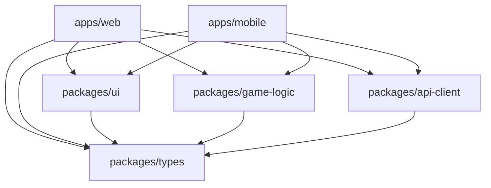

# Contributing Guide

Welcome to the Connect-Star project! This guide will help you understand our development workflow, coding standards, and contribution process.

## Table of Contents

- [Getting Started](#getting-started)
- [Development Workflow](#development-workflow)
- [Code Standards](#code-standards)
- [Testing Requirements](#testing-requirements)
- [Pull Request Process](#pull-request-process)
- [Project Structure](#project-structure)
- [Troubleshooting](#troubleshooting)

## Getting Started

### Prerequisites

Ensure you have the following installed:

- **Node.js** 18+ (LTS recommended)
- **pnpm** 10+ (package manager)
- **Git** for version control
- **Expo CLI** for mobile development

### Initial Setup

```bash
# Clone the repository
git clone <repository-url>
cd Connect-Star

# Install dependencies
pnpm install

# Verify setup
pnpm test
pnpm lint
pnpm type-check
```

### Development Environment

```bash
# Start all applications in development mode
pnpm dev

# Start specific applications
pnpm dev --filter=web      # Web app only
pnpm dev --filter=mobile   # Mobile app only

# Build all packages
pnpm build
```

## Development Workflow

### Branch Strategy

We use a simple branching strategy:

1. **`main`** - Production-ready code
2. **Feature branches** - `feature/your-feature-name`
3. **Bug fixes** - `fix/issue-description`
4. **Chores** - `chore/task-description`

### Creating a Feature

```bash
# Create and switch to a new feature branch
git checkout -b feature/add-multiplayer-support

# Make your changes
# ... develop, test, commit ...

# Push and create pull request
git push origin feature/add-multiplayer-support
```

### Commit Message Convention

We follow [Conventional Commits](https://www.conventionalcommits.org/) format:

```
type(scope): description

[optional body]
```

**Types:**

- `feat` - New features
- `fix` - Bug fixes
- `docs` - Documentation changes
- `style` - Code style/formatting
- `refactor` - Code refactoring
- `test` - Adding or updating tests
- `chore` - Maintenance tasks

**Examples:**

```bash
feat(game-logic): add diagonal win detection
fix(ui): resolve button state inconsistency
docs(testing): add component testing examples
test(api-client): increase coverage for error handling
```

## Code Standards

### TypeScript Guidelines

**Type Safety:**

```typescript
// ✅ Good - Explicit types
interface GameState {
  board: Board;
  currentPlayer: Player;
  winner: Player | null;
}

// ❌ Avoid - Any types
const gameData: any = getData();
```

**Naming Conventions:**

- `PascalCase` for types, interfaces, components
- `camelCase` for variables, functions
- `SCREAMING_SNAKE_CASE` for constants
- `kebab-case` for file names

### React Component Guidelines

**Component Structure:**

```typescript
// ✅ Good component structure
interface ButtonProps {
  variant?: 'primary' | 'secondary' | 'danger';
  size?: 'small' | 'medium' | 'large';
  onClick?: () => void;
  children: React.ReactNode;
}

export function Button({
  variant = 'primary',
  size = 'medium',
  onClick,
  children
}: ButtonProps) {
  return (
    <button
      className={`button button-${variant} button-${size}`}
      onClick={onClick}
    >
      {children}
    </button>
  );
}
```

**Props and State:**

- Always define TypeScript interfaces for props
- Use default parameters for optional props
- Prefer composition over inheritance
- Keep components small and focused

### Code Formatting

We use **Prettier** and **ESLint** for consistent formatting:

```bash
# Format all files
pnpm format

# Check formatting
pnpm format:check

# Lint code
pnpm lint

# Fix linting issues
pnpm lint --fix
```

**Prettier Configuration:**

- 2 spaces for indentation
- Single quotes for strings
- Semicolons required
- Trailing commas in multi-line structures

### Import Organization

```typescript
// ✅ Good import order
// 1. Node modules
import React from 'react';
import { render, screen } from '@testing-library/react';

// 2. Internal packages
import { GameState } from '@connect-star/types';
import { checkWinner } from '@connect-star/game-logic';

// 3. Relative imports
import { Button } from '../Button';
import './GameBoard.css';
```

## Testing Requirements

### Test Coverage Requirements

All contributions must maintain test coverage thresholds:

| Package      | Min Coverage |
| ------------ | ------------ |
| `game-logic` | 80%          |
| `ui`         | 80%          |
| `api-client` | 75%          |
| `mobile`     | 70%          |
| `web`        | 70%          |

### Writing Tests

**Unit Tests (game-logic):**

```typescript
describe('makeMove', () => {
  it('should place piece in correct position', () => {
    const board = createEmptyBoard();
    const result = makeMove(board, 0, 'red');

    expect(result.board[5][0]).toBe('red');
    expect(result.isValid).toBe(true);
  });

  it('should reject invalid column', () => {
    const board = createEmptyBoard();

    expect(() => makeMove(board, -1, 'red')).toThrow();
    expect(() => makeMove(board, 7, 'red')).toThrow();
  });
});
```

**Component Tests (ui):**

```typescript
describe('GameBoard', () => {
  it('should handle column clicks', () => {
    const mockOnColumnClick = jest.fn();
    const board = createTestBoard();

    render(<GameBoard board={board} onColumnClick={mockOnColumnClick} />);

    fireEvent.click(screen.getByLabelText('Drop piece in column 1'));

    expect(mockOnColumnClick).toHaveBeenCalledWith(0);
  });
});
```

### Test Commands

```bash
# Run all tests
pnpm test

# Run tests with coverage
pnpm test:coverage

# Run specific package tests
pnpm test --filter=game-logic

# Watch mode for development
pnpm test --filter=ui -- --watch
```

## Pull Request Process

### Before Creating a PR

1. **Ensure all tests pass:**

   ```bash
   pnpm test
   ```

2. **Check code quality:**

   ```bash
   pnpm lint
   pnpm type-check
   pnpm format:check
   ```

3. **Verify build succeeds:**
   ```bash
   pnpm build
   ```

### PR Requirements

- [ ] **Descriptive title** following conventional commit format
- [ ] **Clear description** of changes and motivation
- [ ] **Tests included** for new functionality
- [ ] **Documentation updated** if necessary
- [ ] **All checks passing** (tests, linting, type-checking)
- [ ] **No merge conflicts** with main branch

### PR Template

```markdown
## Description

Brief description of the changes and their purpose.

## Type of Change

- [ ] Bug fix (non-breaking change which fixes an issue)
- [ ] New feature (non-breaking change which adds functionality)
- [ ] Breaking change (fix or feature that would cause existing functionality to not work as expected)
- [ ] Documentation update

## Testing

- [ ] Unit tests added/updated
- [ ] Component tests added/updated
- [ ] Integration tests added/updated
- [ ] Manual testing performed

## Checklist

- [ ] Code follows the project's coding standards
- [ ] Self-review of code completed
- [ ] Comments added to hard-to-understand areas
- [ ] Documentation updated
- [ ] Tests pass locally
- [ ] No console warnings or errors
```

### Review Process

1. **Automated Checks** - All CI checks must pass
2. **Code Review** - At least one reviewer approval required
3. **Testing** - Reviewer should test functionality when applicable
4. **Merge** - Squash and merge preferred for clean history

## Project Structure

### Monorepo Organization

```
Connect-Star/
├── apps/                 # Applications
│   ├── web/             # Next.js web app
│   └── mobile/          # React Native app
├── packages/            # Shared packages
│   ├── types/           # TypeScript definitions
│   ├── game-logic/      # Core game engine
│   ├── ui/              # React components
│   └── api-client/      # HTTP/WebSocket client
├── docs/                # Documentation
└── tools/               # Build and development tools
```

### Package Dependencies



### Adding New Packages

1. **Create package directory:**

   ```bash
   mkdir packages/new-package
   cd packages/new-package
   ```

2. **Initialize package:**

   ```bash
   npm init -y
   ```

3. **Update package.json:**

   ```json
   {
     "name": "@connect-star/new-package",
     "version": "0.1.0",
     "private": true,
     "main": "./src/index.ts",
     "types": "./src/index.ts"
   }
   ```

4. **Add to workspace dependencies** where needed

## Troubleshooting

### Common Issues

**Build Failures:**

```bash
# Clear all build artifacts
pnpm clean

# Reinstall dependencies
rm -rf node_modules
pnpm install

# Rebuild packages
pnpm build
```

**Test Failures:**

```bash
# Run tests with verbose output
pnpm test -- --verbose

# Run specific test file
pnpm test -- ComponentName.test.tsx

# Clear Jest cache
pnpm test -- --clearCache
```

**Type Errors:**

```bash
# Check types across all packages
pnpm type-check

# Check specific package
cd packages/package-name && pnpm type-check
```

**Mobile Development:**

```bash
# Clear Expo cache
expo start --clear

# Reset Metro bundler
npx react-native start --reset-cache
```

### Getting Help

1. **Check existing issues** in the repository
2. **Search documentation** in the `docs/` directory
3. **Ask questions** in team channels
4. **Create an issue** for bugs or feature requests

### Development Tips

**Performance:**

- Use Turborepo caching: `turbo build --cache`
- Run only affected packages: `pnpm build --filter=changed`
- Use watch mode for active development

**Debugging:**

- Use React DevTools for component debugging
- Use Chrome DevTools for mobile debugging via Expo
- Add `console.log` statements sparingly and remove before commit

**IDE Setup:**

- Install TypeScript and ESLint extensions
- Configure format on save with Prettier
- Enable type checking in your editor

## Code of Conduct

We are committed to providing a welcoming and inclusive environment for all contributors. By participating in this project, you agree to abide by our community standards:

- **Be respectful** in all interactions
- **Provide constructive feedback** during code reviews
- **Ask questions** when unsure about requirements
- **Help others** learn and grow
- **Follow established patterns** unless proposing improvements
- **Welcome newcomers** and help them get started
- **Give credit** where credit is due

## First-Time Contributors

New to open source? Welcome! Here's how to get started:

1. **Fork the repository** on GitHub
2. **Clone your fork** locally: `git clone https://github.com/YOUR_USERNAME/Connect-Star.git`
3. **Set up the development environment** following the instructions above
4. **Look for "good first issue" labels** in the Issues tab
5. **Start small** - documentation fixes and small features are great first contributions
6. **Ask for help** - don't hesitate to ask questions in issues or discussions

### Good First Issues

Look for issues labeled with:

- `good-first-issue` - Perfect for newcomers
- `documentation` - Help improve our docs
- `enhancement` - Small feature additions
- `bug` - Bug fixes (usually well-defined scope)

## Questions?

If you have questions about contributing, please:

1. Check this documentation first
2. Search existing issues and discussions
3. Open a new issue with the "question" label
4. Join our community discussions

## Recognition

All contributors will be recognized in our project! Contributions include:

- Code contributions
- Documentation improvements
- Bug reports and feature requests
- Community support and help
- Testing and feedback

Thank you for contributing to Connect-Star! 🔴🟡
