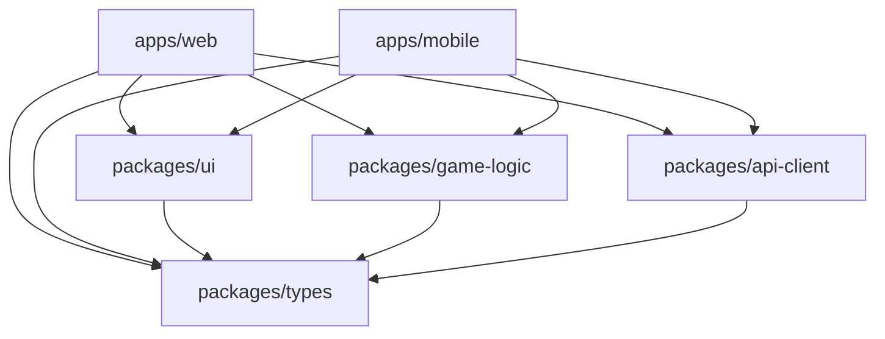

# Connect-Star Project Overview

This document provides a high-level overview of the Connect-Star project architecture, features, and development status.

## Project Summary

Connect-Star is a modern Connect Four game implementation built as a cross-platform application using a monorepo architecture. The project demonstrates best practices in TypeScript development, testing, and code organization.

### Key Features

- 🎮 **Complete Connect Four Game Logic** - Pure TypeScript implementation
- 🌐 **Cross-Platform Support** - Web (Next.js) and Mobile (React Native + Expo)
- 🏗️ **Monorepo Architecture** - Shared code across platforms with Turborepo
- 🧪 **Comprehensive Testing** - 67 tests with high coverage across all packages
- 🔧 **Modern Tooling** - TypeScript, ESLint, Prettier, Jest
- 📱 **Responsive Design** - Optimized for desktop and mobile devices

## Technical Architecture

### Monorepo Structure

```
Connect-Star/
├── apps/                    # Applications
│   ├── web/                # Next.js 14 web application
│   └── mobile/             # React Native + Expo mobile app
├── packages/               # Shared libraries
│   ├── game-logic/         # Connect Four game engine
│   ├── ui/                 # Reusable React components
│   ├── api-client/         # HTTP/WebSocket communication
│   └── types/              # Shared TypeScript definitions
└── docs/                   # Documentation
```

### Technology Stack

| Layer | Technology | Purpose |
|-------|------------|---------|
| **Build System** | Turborepo | Task orchestration, caching |
| **Language** | TypeScript 5.2+ | Type safety, developer experience |
| **Web Framework** | Next.js 14 | SSR, App Router, performance |
| **Mobile Framework** | React Native + Expo 53 | Cross-platform mobile development |
| **Styling** | Tailwind CSS | Utility-first CSS framework |
| **Testing** | Jest + RTL | Unit, component, integration tests |
| **Code Quality** | ESLint + Prettier | Linting, formatting |
| **Package Manager** | pnpm | Fast, efficient dependency management |

### Package Dependencies



## Development Status

### Current Version: 0.2.0

#### ✅ Completed Features

**Core Game Logic:**
- Board state management
- Move validation and execution
- Win condition detection (horizontal, vertical, diagonal)
- Game state transitions
- Edge case handling

**User Interface:**
- Interactive game board component
- Player indicator with turn management
- Responsive button components
- Cross-platform compatibility

**Development Infrastructure:**
- Monorepo setup with Turborepo
- Comprehensive testing suite (67 tests)
- Code quality tools (ESLint, Prettier)
- TypeScript configuration across packages
- Documentation and contribution guides

**Testing Coverage:**
- `game-logic`: 25 unit tests (80%+ coverage)
- `ui`: 29 component tests (80%+ coverage)  
- `api-client`: 13 integration tests (75%+ coverage)
- `mobile/web`: Smoke tests for basic functionality

#### 🚧 In Progress

**API Integration:**
- WebSocket real-time communication
- HTTP client for game management
- Error handling and retry logic

**Mobile Application:**
- Touch-optimized gameplay
- Native mobile components
- Platform-specific optimizations

#### 📋 Planned Features

**Multiplayer Support:**
- Real-time game sessions
- Player matchmaking
- Game room management
- Spectator mode

**Enhanced UI/UX:**
- Game animations and transitions
- Sound effects and music
- Accessibility improvements
- Dark mode support

**Additional Features:**
- Game replay system
- Statistics and leaderboards
- AI opponent with difficulty levels
- Tournament mode

## Quality Metrics

### Test Coverage

| Package | Tests | Coverage | Status |
|---------|-------|----------|--------|
| `game-logic` | 25 | 80%+ | ✅ |
| `ui` | 29 | 80%+ | ✅ |
| `api-client` | 13 | 75%+ | ✅ |
| `mobile` | 1 | Basic | ⚠️ |
| `web` | 1 | Basic | ⚠️ |
| **Total** | **67** | **75%** | ✅ |

### Code Quality

- **TypeScript**: Strict mode enabled, no `any` types
- **ESLint**: Zero linting errors across all packages
- **Prettier**: Consistent code formatting
- **Build**: All packages build successfully
- **Dependencies**: No security vulnerabilities

### Performance

- **Build Time**: <2 minutes full build from scratch
- **Test Execution**: <2 minutes for complete test suite
- **Bundle Size**: Optimized for web and mobile platforms
- **Cache Hit Rate**: >80% with Turborepo caching

## Development Workflow

### Getting Started

```bash
# Clone and setup
git clone <repository-url>
cd Connect-Star
pnpm install

# Development
pnpm dev                    # Start all applications
pnpm test                   # Run all tests
pnpm lint                   # Check code quality
pnpm build                  # Build all packages
```

### Daily Development

```bash
# Feature development
git checkout -b feature/new-feature
pnpm dev --filter=web      # Start specific app
pnpm test --filter=ui      # Test specific package

# Quality checks
pnpm type-check            # TypeScript validation
pnpm format                # Format code
pnpm test:coverage         # Generate coverage report
```

### Release Process

1. **Development** → Feature branches
2. **Testing** → Automated CI/CD pipeline
3. **Review** → Pull request process
4. **Deployment** → Platform-specific builds

## Architecture Decisions

Key architectural decisions are documented in [Architecture Decision Records (ADRs)](adr/):

- [ADR-001: Monorepo Architecture](adr/001-monorepo-architecture.md)
- [ADR-002: Testing Strategy](adr/002-testing-strategy.md)

## Contributing

The project welcomes contributions! Please see:

- [Contributing Guide](CONTRIBUTING.md) - Development workflow and standards
- [Testing Guide](TESTING.md) - Testing practices and coverage requirements
- [Deployment Guide](DEPLOYMENT.md) - Build and deployment instructions

### Contribution Areas

**High Priority:**
- Multiplayer functionality implementation
- Mobile app feature parity
- Performance optimizations
- Accessibility improvements

**Medium Priority:**
- UI/UX enhancements
- Additional test coverage
- Documentation improvements
- Developer experience tools

**Low Priority:**
- Advanced features (AI, tournaments)
- Optimization and refactoring
- Experimental features

## Support and Maintenance

### Documentation

- **README.md** - Quick start and overview
- **docs/** - Comprehensive documentation
- **CHANGELOG.md** - Version history and changes
- **GitHub Issues** - Bug reports and feature requests

### Development Support

- **TypeScript** - Full type safety and IntelliSense
- **Hot Reload** - Fast development feedback
- **Error Boundaries** - Graceful error handling
- **Debugging Tools** - Browser and mobile debugging

### Monitoring

- **Test Suite** - Automated quality validation
- **Build Pipeline** - Continuous integration
- **Code Coverage** - Quality metrics tracking
- **Performance** - Build and runtime monitoring

## Future Roadmap

### Short Term (1-3 months)
- Complete multiplayer implementation
- Mobile app deployment to app stores
- Performance optimization
- Accessibility compliance

### Medium Term (3-6 months)
- AI opponent implementation
- Advanced UI animations
- Social features (friends, chat)
- Analytics and metrics

### Long Term (6+ months)
- Tournament system
- Spectator mode
- Mobile-specific features
- Platform expansion

---

For detailed information about any aspect of the project, please refer to the specific documentation files in the `docs/` directory or create an issue for questions.