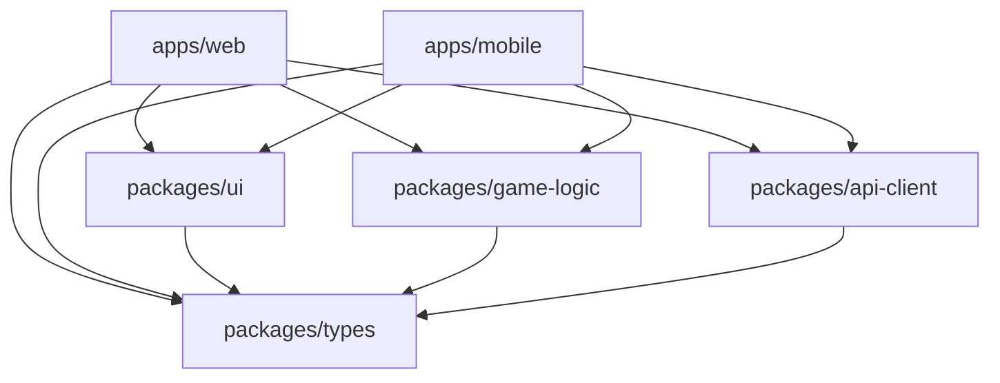

# ADR-001: Monorepo Architecture with Turborepo

## Status

Accepted

## Date

2025-01-10

## Context

We need to build a Connect Four game that supports both web and mobile platforms while maximizing code reuse and maintaining development efficiency. The application requires:

- Shared game logic across platforms
- Consistent UI components between web and mobile
- Type safety throughout the stack
- Efficient development and build processes
- Scalable testing infrastructure

## Decision

We will use a **monorepo architecture** powered by **Turborepo** to organize our codebase with the following structure:

```
Connect-Star/
├── apps/
│   ├── web/          # Next.js web application
│   └── mobile/       # React Native with Expo
├── packages/
│   ├── types/        # Shared TypeScript definitions
│   ├── game-logic/   # Core Connect Four logic
│   ├── ui/           # Shared React components
│   └── api-client/   # HTTP/WebSocket client
```

## Rationale

### Benefits of Monorepo

1. **Code Reuse**: Game logic, types, and UI components shared across platforms
2. **Atomic Changes**: Modifications across multiple packages in single commits
3. **Consistent Dependencies**: Unified dependency management and versioning
4. **Developer Experience**: Single repository to clone, unified tooling
5. **Testing**: Cross-package integration testing capabilities

### Why Turborepo

1. **Performance**: Intelligent caching and parallelization of tasks
2. **Incremental Builds**: Only rebuild packages that have changed
3. **Task Orchestration**: Dependency-aware task execution
4. **Simple Configuration**: Minimal setup compared to alternatives
5. **Active Development**: Strong community and frequent updates

### Alternative Considered

**Nx**: More feature-rich but adds complexity we don't currently need
**Lerna**: Lacks modern caching and performance optimizations
**Rush**: More suited for larger organizations with complex workflows

## Implementation Details

### Package Dependencies



### Turborepo Configuration

```json
{
  "tasks": {
    "build": {
      "dependsOn": ["^build"],
      "outputs": [".next/**", "dist/**"]
    },
    "test": {
      "dependsOn": ["^build"]
    },
    "lint": {
      "dependsOn": ["^lint"]
    }
  }
}
```

### Development Workflow

- **Parallel Development**: Teams can work on different apps simultaneously
- **Shared Updates**: Changes to shared packages automatically trigger rebuilds
- **Consistent Tooling**: Same ESLint, Prettier, TypeScript configs across packages
- **Unified Testing**: Run all tests with single command, parallel execution

## Consequences

### Positive

- **Faster Development**: Shared code reduces duplication
- **Type Safety**: End-to-end TypeScript integration
- **Efficient Builds**: Turborepo caching dramatically improves CI/CD times
- **Easier Refactoring**: Cross-package changes in atomic commits
- **Consistent Quality**: Unified linting, formatting, and testing

### Negative

- **Initial Complexity**: Steeper learning curve for developers new to monorepos
- **Tooling Dependencies**: Reliance on Turborepo for optimal performance
- **Repository Size**: Single large repository vs. multiple smaller ones
- **Git History**: All packages share the same commit history

### Mitigation Strategies

- **Documentation**: Comprehensive guides for monorepo workflows
- **Tooling**: Clear scripts and automation for common tasks
- **Training**: Team education on monorepo best practices
- **Monitoring**: Track build performance and optimization opportunities

## Implementation Timeline

1. **Phase 1**: Set up basic monorepo structure with Turborepo
2. **Phase 2**: Migrate existing packages and establish build pipeline
3. **Phase 3**: Implement shared testing infrastructure
4. **Phase 4**: Optimize caching and performance
5. **Phase 5**: Document workflows and best practices

## Success Metrics

- **Build Time**: <2 minutes for full build from scratch
- **Cache Hit Rate**: >80% for incremental builds
- **Code Reuse**: >60% of logic shared between platforms
- **Developer Satisfaction**: Positive feedback on development experience
- **Deployment Frequency**: Daily deployments enabled by fast builds

## References

- [Turborepo Documentation](https://turbo.build/)
- [Monorepo Best Practices](https://monorepo.tools/)
- [JavaScript Monorepos Guide](https://www.toptal.com/front-end/guide-to-monorepos)
